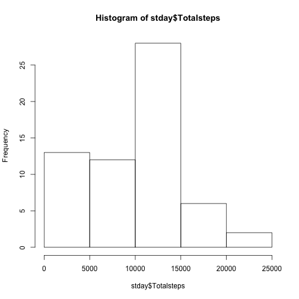
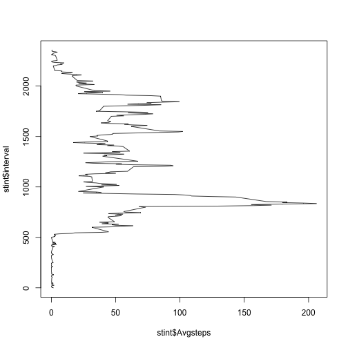
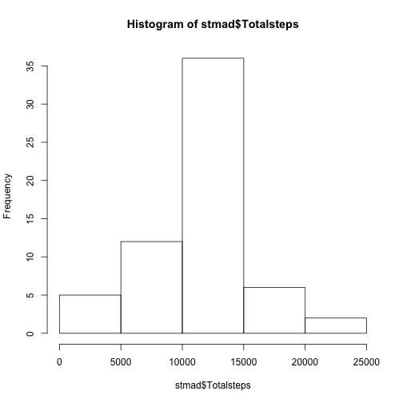
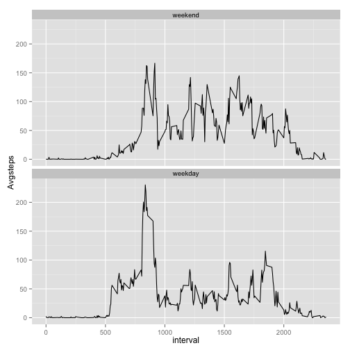

##Our first step is to load the necessary data for the assignment. 
First I set my working directory to the directory I have downloaded the course dataset to.  .../Rclass/Reproducible/

Next read it in

```r
st<-read.csv("~/Desktop/Rclass/Reproducible/activity.csv")
```

##What is mean total number of steps taken per day?
For this part of the assignment, you can ignore the missing values in the dataset.

Calculate the total number of steps taken per day

```r
library(dplyr)
stday<-summarise(group_by(st, date), Totalsteps=sum(steps, na.rm=TRUE))
head(stday)
```

```
## Source: local data frame [6 x 2]
## 
##         date Totalsteps
## 1 2012-10-01          0
## 2 2012-10-02        126
## 3 2012-10-03      11352
## 4 2012-10-04      12116
## 5 2012-10-05      13294
## 6 2012-10-06      15420
```

Make a histogram of the total number of steps taken each day

```r
hist(stday$Totalsteps)
```

 

Calculate and report the mean and median of the total number of steps taken per day


```r
stday %>% summarise(mean=mean(Totalsteps), median=median(Totalsteps))
```

```
## Source: local data frame [1 x 2]
## 
##      mean median
## 1 9354.23  10395
```

##What is the average daily activity pattern?

Make a time series plot (i.e. type = "l") of the 5-minute interval (x-axis) and the average number of steps taken, averaged across all days (y-axis)


```r
stint<-summarise(group_by(st, interval), Avgsteps=mean(steps, na.rm=TRUE))
plot(stint$Avgsteps, stint$interval, type="l")
```

 

Which 5-minute interval, on average across all the days in the dataset, contains the maximum number of steps?


```r
max(stint$Avgsteps)
```

```
## [1] 206.1698
```

```r
subset(stint, Avgsteps>200)
```

```
## Source: local data frame [1 x 2]
## 
##   interval Avgsteps
## 1      835 206.1698
```
Identified max agerage number of steps = 206; Corresponding interval is 835.


##Imputing missing values

*Note that there are a number of days/intervals where there are missing values (coded as NA). The presence of missing days may introduce bias into some calculations or summaries of the data.*

Calculate and report the total number of missing values in the dataset (i.e. the total number of rows with NAs)

```r
sum(is.na(st))
```

```
## [1] 2304
```
Devise a strategy for filling in all of the missing values in the dataset. The strategy does not need to be sophisticated. For example, you could use the mean/median for that day, or the mean for that 5-minute interval, etc.

**Strategy chosen is to replace using mean steps for that time interval across all days.**

Create a new dataset that is equal to the original dataset but with the missing data filled in.

```r
stm<-mutate(group_by(st, interval), Avg=mean(steps, na.rm=TRUE))
test<-subset(stm, is.na(steps))
test$steps<-test$Avg
stm1<-na.omit(stm)
stma<-bind_rows(stm1, test)
summary(stm)
```

```
##      steps                date          interval           Avg         
##  Min.   :  0.00   2012-10-01:  288   Min.   :   0.0   Min.   :  0.000  
##  1st Qu.:  0.00   2012-10-02:  288   1st Qu.: 588.8   1st Qu.:  2.486  
##  Median :  0.00   2012-10-03:  288   Median :1177.5   Median : 34.113  
##  Mean   : 37.38   2012-10-04:  288   Mean   :1177.5   Mean   : 37.383  
##  3rd Qu.: 12.00   2012-10-05:  288   3rd Qu.:1766.2   3rd Qu.: 52.835  
##  Max.   :806.00   2012-10-06:  288   Max.   :2355.0   Max.   :206.170  
##  NA's   :2304     (Other)   :15840
```

```r
summary(stma)
```

```
##      steps                date          interval           Avg         
##  Min.   :  0.00   2012-10-01:  288   Min.   :   0.0   Min.   :  0.000  
##  1st Qu.:  0.00   2012-10-02:  288   1st Qu.: 588.8   1st Qu.:  2.486  
##  Median :  0.00   2012-10-03:  288   Median :1177.5   Median : 34.113  
##  Mean   : 37.38   2012-10-04:  288   Mean   :1177.5   Mean   : 37.383  
##  3rd Qu.: 27.00   2012-10-05:  288   3rd Qu.:1766.2   3rd Qu.: 52.835  
##  Max.   :806.00   2012-10-06:  288   Max.   :2355.0   Max.   :206.170  
##                   (Other)   :15840
```
For the new replaced set  


Make a histogram of the total number of steps taken each day 

```r
stmad<-summarise(group_by(stma, date), Totalsteps=sum(steps, na.rm=TRUE))

hist(stmad$Totalsteps) 
```

 
Calculate and report the mean and median total number of steps taken per day.


```r
stmad %>% summarise(mean=mean(Totalsteps), median=median(Totalsteps))
```

```
## Source: local data frame [1 x 2]
## 
##       mean   median
## 1 10766.19 10766.19
```
Do these values differ from the estimates from the first part of the assignment? What is the impact of imputing missing data on the estimates of the total daily number of steps?

*Both mean and median total steps are higher with mean imputation. Missing data brings the distribution more to the center.*

##Are there differences in activity patterns between weekdays and weekends?

For this part the weekdays() function may be of some help here. Use the dataset with the filled-in missing values for this part.

Create a new factor variable in the dataset with two levels – “weekday” and “weekend” indicating whether a given date is a weekday or weekend day.


```r
library(timeDate)
stma$wkday<-isWeekday(as.Date(as.character(stma$date)))
stma$wkday<-as.factor(stma$wkday)
levels(stma$wkday)[levels(stma$wkday)=="TRUE"] <- "weekday"
levels(stma$wkday)[levels(stma$wkday)=="FALSE"] <- "weekend"
summary(stma$wkday)
```

```
## weekend weekday 
##    4608   12960
```
Make a panel plot containing a time series plot (i.e. type = "l") of the 5-minute interval (x-axis) and the average number of steps taken, averaged across all weekday days or weekend days (y-axis). See the README file in the GitHub repository to see an example of what this plot should look like using simulated data.

```r
library(ggplot2)
stmawkday<-summarise(group_by(stma, wkday, interval), Avgsteps=mean(steps, na.rm=TRUE))
summary(stmawkday)
```

```
##      wkday        interval         Avgsteps      
##  weekend:288   Min.   :   0.0   Min.   :  0.000  
##  weekday:288   1st Qu.: 588.8   1st Qu.:  2.047  
##                Median :1177.5   Median : 28.133  
##                Mean   :1177.5   Mean   : 38.988  
##                3rd Qu.:1766.2   3rd Qu.: 61.263  
##                Max.   :2355.0   Max.   :230.378
```

```r
ggplot(stmawkday, aes(interval, Avgsteps))+geom_line()+facet_wrap(~wkday, ncol=1)
```

 

The weekday graph shows a much larger and sudden increase in activity in the morning, and then has lower activity through the afternoon.
